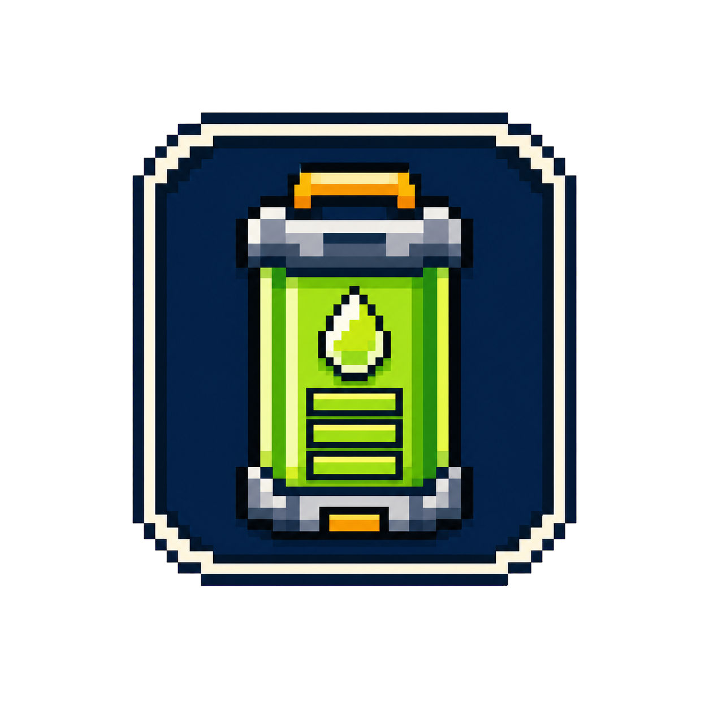
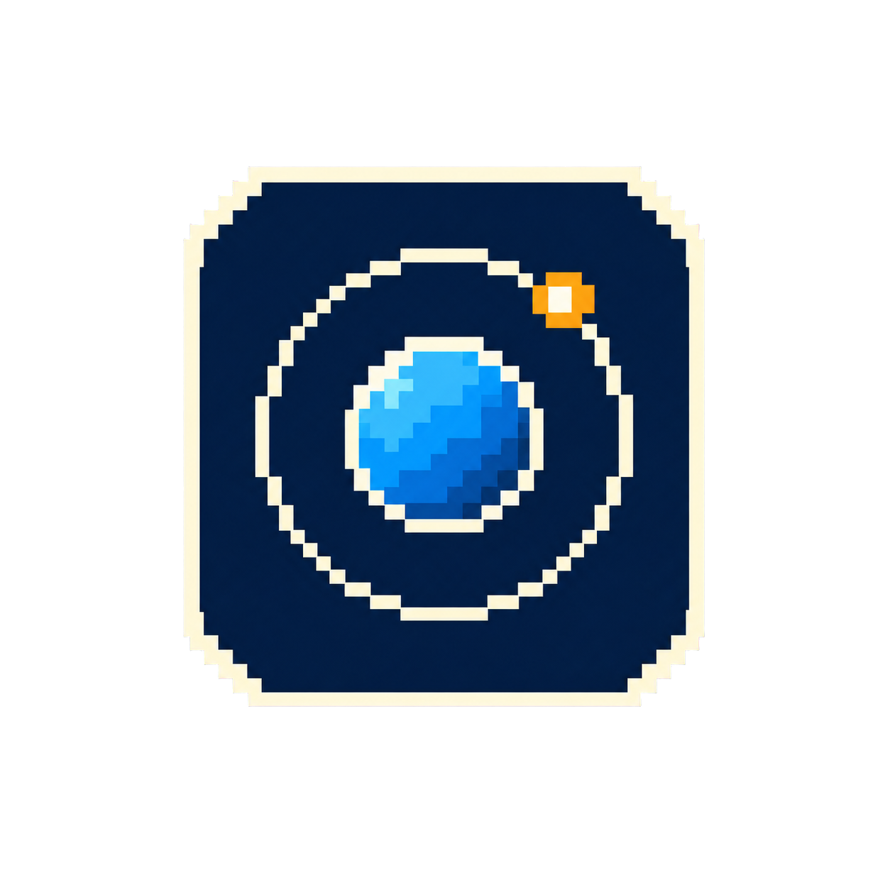
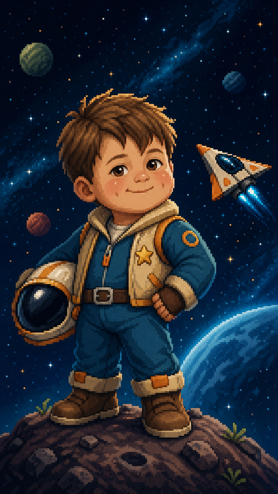
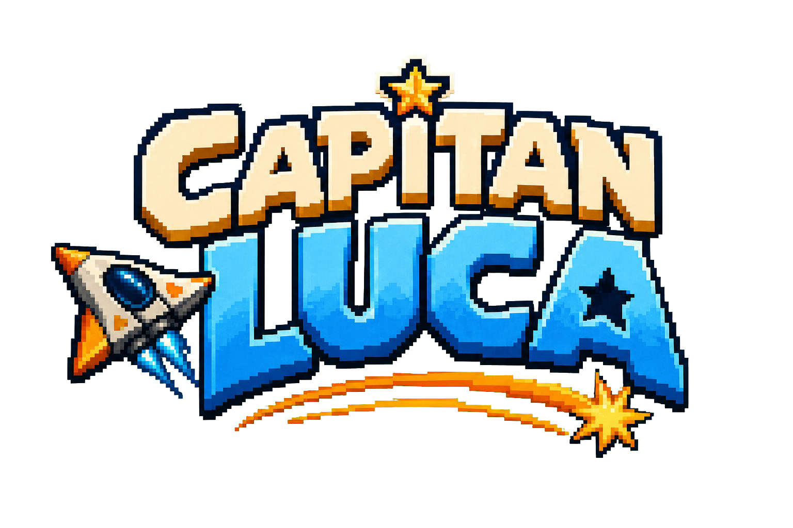
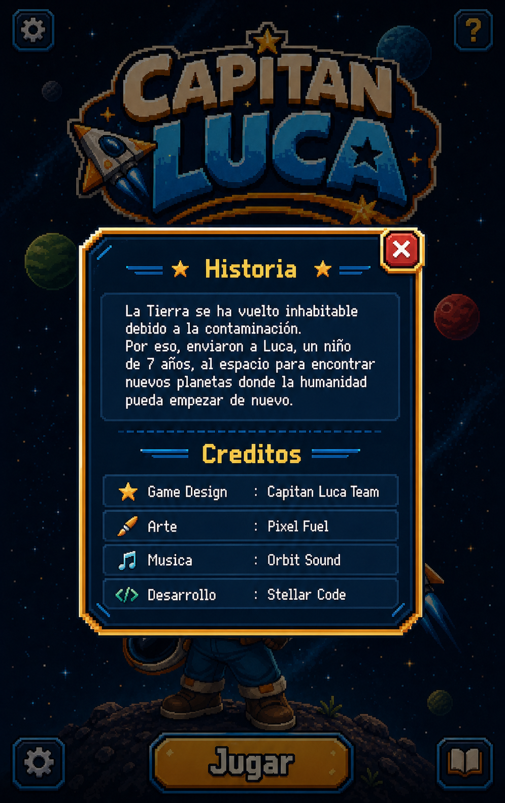
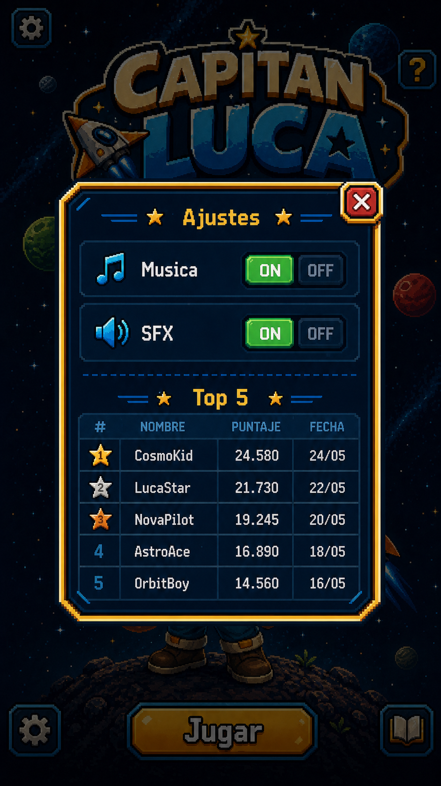
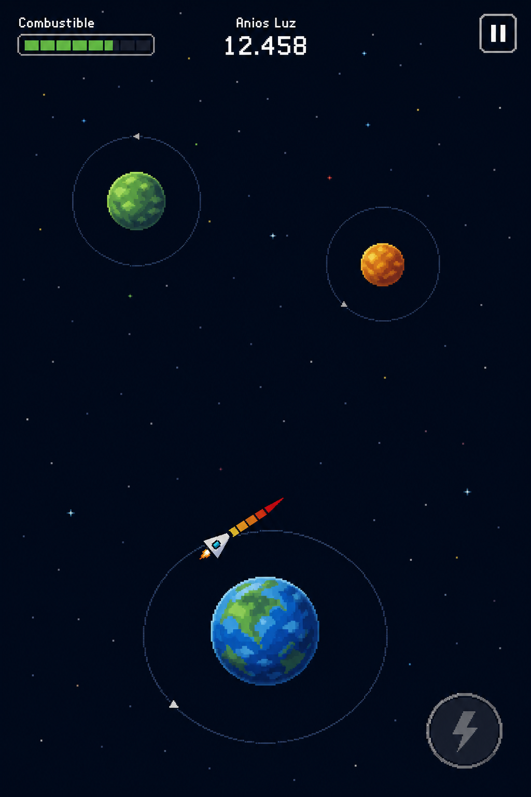

# 🎮 GDD – El Capitán Luca

## 1. Visión General

- **Título**: El Capitán Luca
- **Género**: Arcade / Endless / Skill-based
- **Plataforma**: Mobile (portrait)
- **Motor**: Godot Engine 4
- **Lenguaje**: GDScript
- **Resolución objetivo**: 1920x1080 (Full HD, escalado)
- **Assets**: Texture atlas (TexturePacker o equivalente)
- **Estilo**: Minimalista, pixel art, geométrico

### Premisa

Luca, un niño de 7 años, es enviado al espacio para encontrar planetas habitables debido a la contaminación en la Tierra.

El objetivo es recorrer la mayor cantidad de **años luz** posible mediante saltos planetarios.

---

## 2. Core Gameplay

### Loop principal

1. La nave orbita automáticamente un planeta
2. El jugador mantiene presionado para cargar impulso
3. Suelta para ejecutar el salto
4. La trayectoria se calcula con física (vectores)
5. Intenta alcanzar un nuevo planeta
6. Repite hasta perder

---

## 3. Controles

- **Tap sostenido** → carga de impulso
- **Release** → ejecución del salto
- Durante la selección de dirección se muestra un único indicador de carga
- El indicador muestra dirección y potencia del impulso en la dirección hacia el dedo del jugador
- El indicador no aparece al lado del dedo, sino orientado según la dirección apuntada
- El indicador de impulso es relativamente corto y no invade gran parte de la pantalla
- Su forma base es un triángulo sutil orientado desde la nave
- El triángulo se va llenando progresivamente según la potencia acumulada
- A máxima carga el relleno llega a rojo

---

## 4. Física del juego

### Vectores involucrados

- Vector tangencial de la órbita
- Vector de impulso del jugador
- Gravedad del planeta actual
- Gravedad de planetas cercanos

La trayectoria final es la suma de estos vectores.

---

## 5. Planetas

### Generación

- Procedural infinita
- Siempre hay entre **1 y 3 planetas alcanzables**

### Tamaños

- Existen **5 tamaños** de planetas: diminuto, pequeño, mediano, grande y muy grande
- El planeta actual no recibe zoom especial por cámara
- El planeta actual mantiene una escala visual consistente con los demás planetas visibles
- El planeta más grande no puede ocupar más de **1/4 del ancho horizontal** de la pantalla

### Tipos (inferencia visual)

| Tipo     | Color | Nivel gravedad | Slot |
|----------|------|----------------|------|
| Enano    | Gris | Muy baja       | 1/5  |
| Gaseoso  | Amarillo | Media-baja | 2/5  |
| Verde    | Verde | Media         | 3/5  |
| Azul     | Azul | Media-alta     | 4/5  |
| Rojo     | Rojo | Alta           | 5/5  |

- La gravedad real se oculta
- El jugador la infiere por tamaño + color

---

## 6. Power-ups

### Tipos

- ⛽ Recarga de combustible
- ⚡ Cálculo orbital

### Referencias visuales

Recarga de combustible:

Cálculo orbital:

### Comportamiento

- Orbitan el planeta
- Velocidad = **½ de la velocidad mínima orbital**
- Garantiza colisión eventual con la nave

### Cálculo orbital

- Máximo acumulable: **3**
- Si no está habilitado, no se muestran ayudas visuales de trayectoria o vectores
- Sin cálculo orbital activo, el único feedback de apuntado es el indicador de carga del impulso

#### Opción A (detallado)
Muestra:
- Vector tangencial
- Gravedad del planeta actual
- Gravedad de otros planetas
- Dirección del input
- Trayectoria estimada

#### Opción B (simplificado)
- Muestra **vector final resultante**

*(Decisión pendiente)*

---

## 7. Combustible

- Recurso limitado
- Se consume en cada impulso
- Se recarga con power-ups

---

## 8. Condiciones de derrota

- Sin combustible
- Perdido en el espacio (sin órbita)
- Salir del mapa
- Colisión con otro planeta
- **Colisión con el propio planeta al salir**

---

## 9. UI / UX

### Pantallas

#### Splash
- Nave + espacio
- Referencia visual de personaje / tono:

#### Home
- Reutiliza el mismo parallax espacial del gameplay
- Logo principal
- Botón **Jugar**
- Botón **Settings**
- Botón **?** (historia + créditos)
- Referencia visual de logo:

- Referencia visual del modal de historia y créditos:

#### Settings (modal)
- Música ON/OFF
- SFX ON/OFF
- Top 5 integrado en el mismo modal
- Cada entrada muestra: nombre, puntaje y fecha

- Referencia visual actual:

#### Ranking
- Top 5 jugadores
- Persistente local
- Se muestra dentro del modal de Settings
- Cada entrada muestra: nombre, puntaje y fecha

#### Game Over
- Mensaje "Game Over"
- Motivo de derrota
- Años luz recorridos
- Si entra en Top 5:
  - Input nombre
- Botones:
  - Reintentar
  - Volver al menú

---

## 10. HUD In-game

### Composición in-game

- El planeta actual siempre queda centrado en el eje horizontal de la pantalla
- Su posición vertical queda lo más abajo posible
- El planeta y su órbita deben permanecer completamente visibles dentro de pantalla
- Las órbitas visibles se representan como círculos, no como elipses
- El planeta actual no se agranda por estar en foco

### HUD

- Botón de pausa en la esquina superior derecha
- Barra de combustible en la parte superior izquierda
- Distancia en años luz centrada en la parte superior
- Botón ⚡ (cálculo orbital) en la esquina inferior derecha
- Indicador de carga de impulso orientado hacia la dirección seleccionada por el jugador
- El indicador de carga no se dibuja junto al dedo o punto de contacto
- El indicador de carga usa una lectura visual triangular, sutil y de longitud contenida

### Referencia visual actual

---

## 11. Arte

### Estilo

- Pixel art simple
- Cartoon / amigable
- Bajo costo de producción

### Elementos

- Planetas → círculos
- Nave → triángulo
- Power-ups → cuadrados

### Fondo

- Parallax de estrellas (2–3 capas)

---

## 12. Audio

### Música
- Loop espacial ambiental
- Fuente:
  - OpenGameArt
  - Free Music Archive

### SFX
- Impulso
- Recolección
- Game Over

---

## 13. Filosofía de diseño

- Arcade clásico
- Sin guardado de partida
- Sesiones cortas
- Skill-based
- Aprendizaje por intuición

---

## 14. Pendientes

- Definir opción final de cálculo orbital
- Balancear gravedad vs distancia
- Ajustar consumo de combustible
- Feedback visual de velocidad orbital
